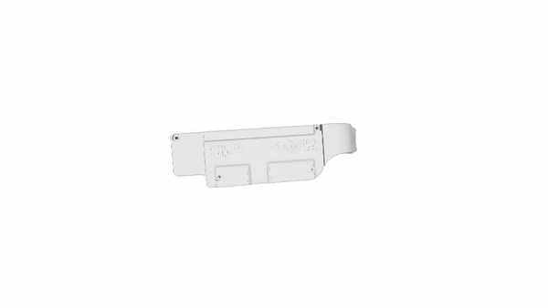

# SpeakSight Mobile - Assistance App for Deaf People

SpeakSight Mobile is a mobile application designed for deaf individuals, enabling smoother and more accessible communication through the use of SpeakSight smart glasses. These glasses act as a virtual assistant, transcribing conversations in real-time and also providing sign language translation.



## Features

- **Real-time Transcription:** Captures and transcribes conversations in real-time using voice recognition technology.
- **Sign Language Translation:** Allows translation of conversations into sign language using the phone's camera.
- **Bluetooth Connection:** Connects to SpeakSight glasses via Bluetooth for a seamless user experience.
- **Customization:** Offers customization options for user preferences, such as subtitle size and style.

## Installation

1. Clone this repository:
   ```bash
   git clone https://github.com/josephsamijona/Speaksight_mobile.git
